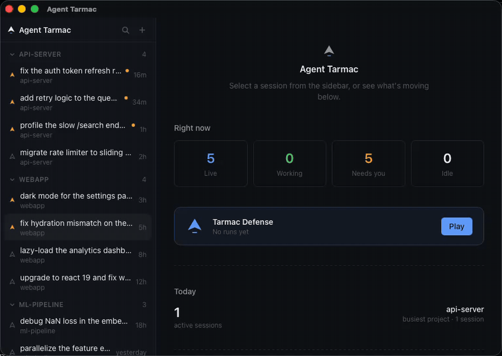

<p align="center">
  
</p>

<p align="center">
  Mission control for your coding agents.
</p>

<p align="center">
  <a href="https://github.com/aknakshay/Agent-Tarmac/actions/workflows/ci.yml"></a>
  <a href="LICENSE"></a>
</p>

Running many [Claude Code](https://docs.claude.com/en/docs/claude-code) sessions in parallel — often 20+, spread across terminal windows — makes them impossible to track: no way to see which ones need you, no single place to resume or stop them, and every reboot feels risky. Agent Tarmac is a single-window macOS desktop app that turns `~/.claude/projects` into a live dashboard: every session ever run, from any terminal, browsable and resumable, with per-session status so you can glance at twenty sessions and know which one is holding short for a decision.

It's agent-agnostic by design — Claude Code is the only backend today, with Codex and Gemini planned (see [Roadmap](#roadmap)).



## Features

- **Dashboard over every session** — not a walled garden of app-created sessions. Anything `claude --resume`-able shows up, regardless of where it was started.
- **Embedded terminals** — interact with live sessions inside the app, sidebar + terminal pane, like a chat client.
- **Activity-aware sidebar** — per-session status (`Working` / `NeedsYou` / `Idle` / `Dormant`), with badges and optional macOS notifications for the one thing you actually need to know: which session is blocked on you.
- **Restore workspace** — after a reboot, one click respawns everything that was running.
- **Pop out to Ghostty** — eject any session to a real terminal; Agent Tarmac keeps tracking it via transcript watching.
- **Stop** — a graceful `SIGTERM` to a session's process group, no orphaned processes.

## Install

Agent Tarmac isn't in a store yet — build it from source:

```sh
git clone https://github.com/aknakshay/Agent-Tarmac.git
cd agent-tarmac
npm install
npm run tauri build
```

The bundled app lands in `src-tauri/target/release/bundle/macos/`. For local development:

```sh
npm run tauri dev
```

Requires the [Claude Code CLI](https://docs.claude.com/en/docs/claude-code) (`claude`) on your `PATH`; the app checks for it and tells you if it's missing.

## Development

### Dev loop with a fake `claude`

`scripts/fake-claude.sh` is a stand-in for the real CLI — it starts, prompts, and echoes stdin without touching a real Claude Code session, so you can develop and test the whole app loop without spending real agent turns:

```sh
export AGENT_TARMAC_PROJECTS_DIR="$PWD/src-tauri/tests/fixtures/projects"
export AGENT_TARMAC_CLAUDE_BIN="$PWD/scripts/fake-claude.sh"
npm run tauri dev
```

`AGENT_TARMAC_PROJECTS_DIR` points the session index at a fixture directory instead of the real `~/.claude/projects`; `AGENT_TARMAC_CLAUDE_BIN` swaps in the fake binary everywhere the app would otherwise spawn `claude`. Both env vars are read once at startup by the Rust backend (`session_index.rs`, `pty_manager.rs`).

### Tests

```sh
npm test               # vitest — frontend store, workspace metadata
cd src-tauri && cargo test   # Rust — PTY manager, activity state machine, session index
```

See [CONTRIBUTING.md](CONTRIBUTING.md) for the full checklist before opening a PR.

## How it compares

|  | Agent Tarmac | [FleetCode](https://github.com/built-by-as/FleetCode) | [opcode](https://github.com/winfunc/opcode) | claude-terminal / cc-pane | agent-session-manager |
|---|---|---|---|---|---|
| Sessions started outside the app | ✅ any session in `~/.claude/projects` | ❌ app-created only | ❌ chat GUI, not a terminal cockpit | ❌ layout manager only | ✅ |
| Live activity status (Working/NeedsYou/etc.) | ✅ | ❌ | ❌ | ❌ | ➖ unclear |
| Embedded terminal | ✅ | ✅ | ❌ | ✅ | ✅ |
| Restore workspace after reboot | ✅ | ➖ persistence, not one-click restore | ❌ | ❌ | ➖ unclear |
| Pop out to a real terminal, keep tracking | ✅ | ❌ | ❌ | ❌ | ❌ |
| Platform | macOS (full support) · Linux (compiles, runtime untested — contributions welcome, see [#13](https://github.com/aknakshay/Agent-Tarmac/issues/13)) | Node/Electron | macOS/Linux/Windows (Tauri) | macOS (Tauri) | Linux only (GTK4) |

FleetCode is the closest competitor — multi-session embedded terminals with `--resume` persistence and git-worktree isolation — but it only manages sessions it created and has no activity status. Agent Tarmac is mission control for every session on the machine, with live status, regardless of what started it.

## Known limitations

- None currently blocking. Popped-out sessions now survive app restarts: the external set is persisted and reconciled against still-running processes at startup (v0.2.0). Found something? [Open an issue](https://github.com/aknakshay/Agent-Tarmac/issues).

## Roadmap

Tracked as GitHub issues:

- **Next up: signed auto-update** — one-click in-place updates (the in-app check currently notifies and links to the GitHub release page)
- Git-worktree isolation per session
- Codex and Gemini backend support
- tmux backend (alternative to the native PTY manager)
- Tier-3 hooks integration
- Token/cost telemetry
- Settings pane (notification toggle, clear-metadata action)
- Web/mobile remote access
- Linux runtime support (compiles + CI-checked today; see [#13](https://github.com/aknakshay/Agent-Tarmac/issues/13)) and Windows support
- Persist which session tabs were open across a restart (which panes were open, not just which were live) and reopen them without auto-resuming dormant ones

## License

[MIT](LICENSE)
